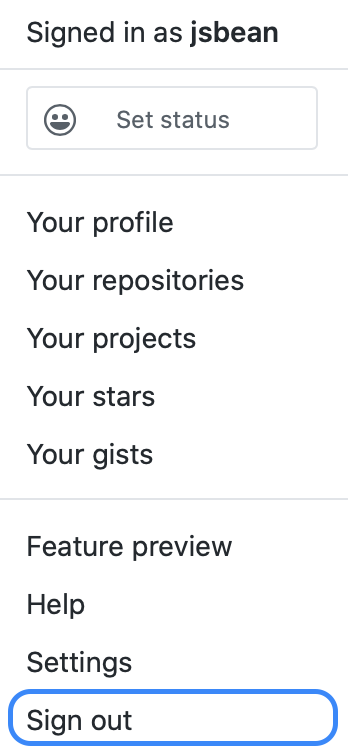

# Accounts

To contribute to a repository on Github, you need to create an account. This is free!

Visit the [Github homepage](https://github.com). 

If you are on a browser which is currently logged into a Github account, click on the avatar on the top right:

Click "Sign out" at the bottom of the menu that appears:

Otherwise, you will see the button on the top right to `Sign up` on the top right:

Click the `Sign up` button and follow the instructions from there.