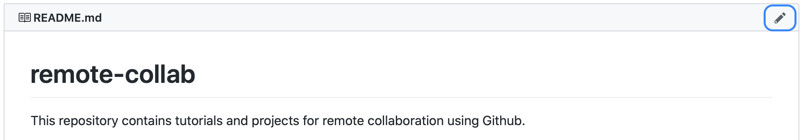
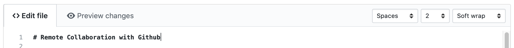
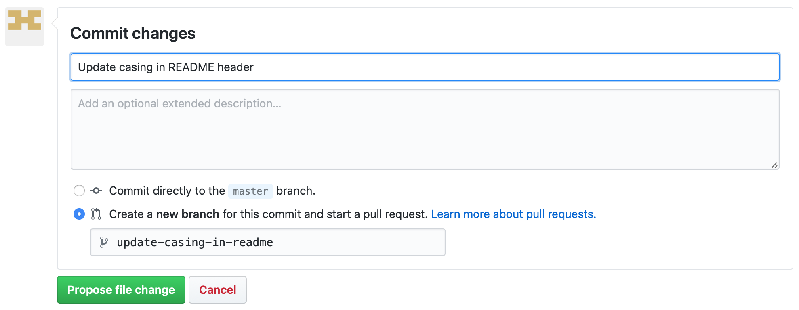
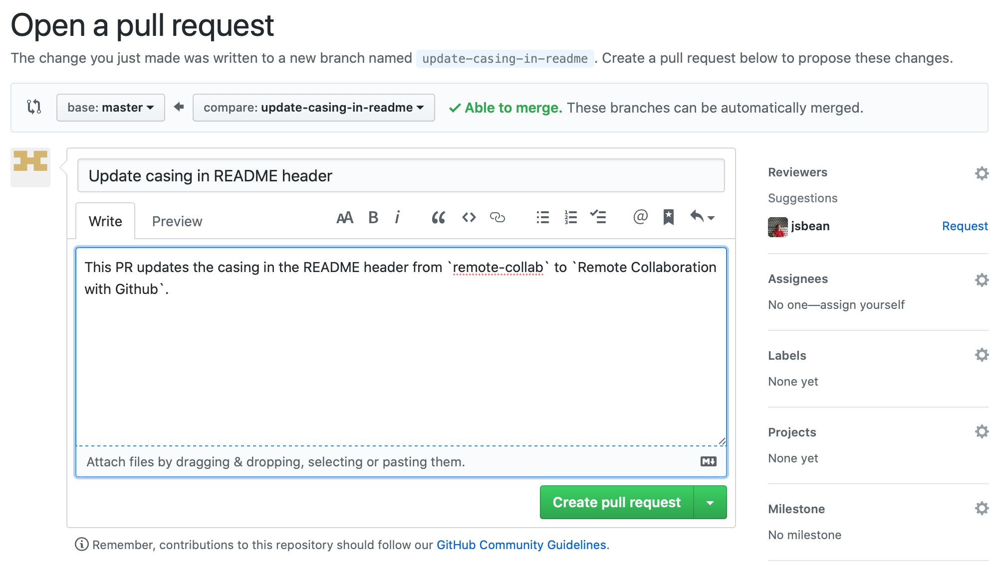
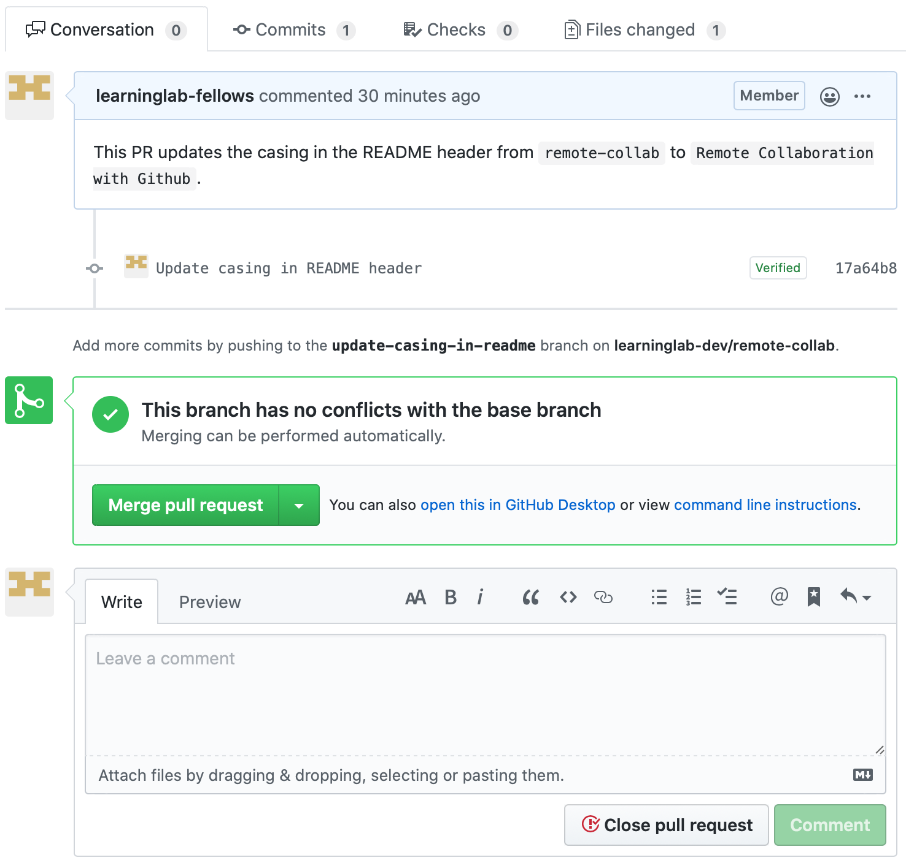

# Editing Files on Github

## Prereqs

Before we start, make sure you have [an account](Accounts.md) and that you belong to the `learninglab-dev` organization.

## Making a simple edit to a text file

Let's propose a simple edit to the [`README.md`](../README.md) for this repository, by clicking on the pencil icon on the top right of the README preview.

You should see the "raw" version of the file you would like to edit. You can type directly within the text field to make your changes.

Here, we are just changing the top header from **remote-collab** to **Remote Collaboration with Github**, to make it feel a little bit more buttoned up. While this is a very simple change to make, it may involve a major change to the branding of our project, and thus may require discussion with people throughout the organization.

After we have made our change to the source text, scroll down to the section describing how you would like to "commit" or "propose to commit" our changes.

You will be asked to create a [message](https://chris.beams.io/posts/git-commit/) for our change (i.e., our "commit"). Take the crafting of this message seriously, because this is the message that is displayed in a log of all of the changes made to a project.

Select the radio button for "Create a **new branch** for this commit and start a pull request", and give it a simple name in [kebab-case](https://wiki.c2.com/?KebabCase). 

*By selecting this option, rather than committing "directly to the `master` branch," you will create a discussion around the the changes that you propose to make, rather than changing the project directly. This is a much safer method, because people on your team may catch some problems in your proposed change that may otherwise sneak into the current working version of your project.*

Select the `Propose file change` button, and you will see your change transform into a **Pull Request**.

A **Pull Request** (PR) is a proposal to change some source material in a repository, which consists of a title, a message, and one or more **commits**. Here, you can craft a title and message for your PR. Once you feel happy with it, select the `Create pull request` button, and you will be able to see your proposed changes and the related conversation between you and your colleagues.

When everyone is happy with the changes, someone in the organization can select the `Merge pull request` button to integrate the changes into the project for real.
