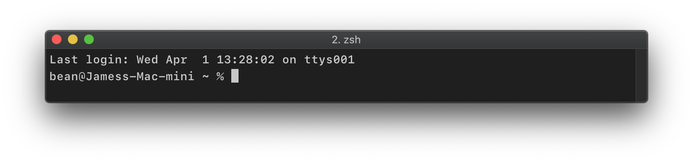
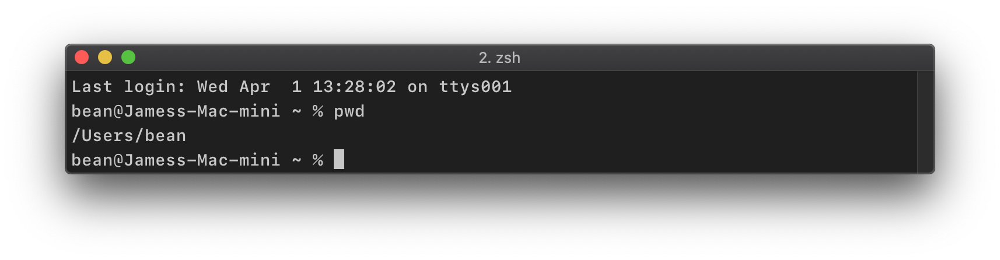

# Getting Around in the Shell

This tutorial will show you the basics of navigating the file structure of your computer using the command line. We won't be creating, deleting, or manipulating any files or directories here: we are *just browsing*. 

*If you want to get creative, destructive, or manipulative, we have a [tutorial for that](ModifyingContentsShell.md).*

## Table of Contents

0. [Prereqs](#prereqs)
1. [Suiting Up](#suiting-up)
2. [Where are We?](#where-are-we)
3. [Diving In](#diving-in)

## Prereqs

- You are reading this on a computer with a keyboard of some sort
- You have the `Terminal` application or an equivalent command line interface installed

## Suiting Up

Before we can start diving into you file structure, we need to assemble the necessary tools.

In this case, all we need to do is open up the `Terminal` application (or your favorite shell interface) and we should be all set. 

You should see something like this:

_I hope you don't see `bean@Jamess-Mac-mini` in your shell. However, what you do see should look familiar to you!_

## Where are We?

First, let's look at a few shell commands that tell us something about where we are. 

- [Print Working Directory (`pwd`)](#print-working-directory-pwd)
- [List Directory Contents (`ls`)](#list-directory-contents-ls)
- [Open in Finder (`open .`)](#open-in-finder-open-.)

You can run these commands any time (and you are encouraged to!), because it can be an easy way to prevent yourself from doing something you may regret.

### Print Working Directory (`pwd`)

Type the following line into the terminal, then press **enter** or **return**:

	pwd
	
You have just run the "print working directory" command, and a path to your home directory should have been printed on the screen right below `pwd`. This path should look familiar. 

I get something like this:

### List Directory Contents (`ls`)

Another way to get a sense of our surroundings is to run the "list directory contents" command:

	ls
	
This should list all of the files and subdirectories in your current working directory.

*I won't show you all of the files and subdirectories on my computer, in case it turns out you are a super sophisticated hacker, in which case you don't really need to be reading this tutorial.*

### Open in `Finder` (`open .`)

Especially while you are getting comfortable with hanging around in the shell, it is helpful to see another representation of your file system in a more familiar format: the `Finder`.

Run the following command:

	open .
	
This should open up your current working directory (i.e., `.`) in the `Finder` application, which is just a graphical user interface for navigating and modifying the file system on your computer. What you see in the `Finder` should match up with what you see in the `Terminal`.

## Diving In

Now that we have tools to determine where we are, and what files and subdirectories we have to work with, let's look at some commands that allow us to move around in our file system. 

- [Move down into a Subdirectory (`cd`)](#move-down-into-a-subdirectory-cd)
- [Move up to the Parent Directory (`cd ..`)](#move-up-to-the-parent-directory-cd-..)

Again, we aren't modifying anything in the file system here, so what we are doing is not dangerous — don't fear!

 

### Move down into a Subdirectory (`cd`)

After running the `ls` command, you should see a list of the files and subdirectories in your current working directory.

Try running the following command, replacing `name_of_some_directory` with the name of some directory that shows up when you run the `ls` command.

	cd name_of_some_directory
	
If you attempt to `cd` into a file, rather than a subdirectory, you will see the following error:

	cd: not a directory: name_of_some_file
	
💡 _If you type the first letter of a subdirectory (or a file) in the current working directory and press **tab**, the `Terminal` will autocomplete the rest of the name. This makes navigating around your file system a breeze._

### Move up to the Parent Directory (`cd ..`)

In addition to moving down into subdirectories, you can move up to the parent directory containing the current working directory. Similar to using the single dot (`.`) when using the `open` command to show the current working directory in the `Finder`, we can use the double dot (`..`) to move back up into the parent directory.

	cd ..
	
## Take the commands for a ride!

Now you have all of the commands you need to take a spin through your entire file system in the shell. Feel free to `cd` into and out of all sorts of directories, using the `pwd` and `ls` to show where you are and where you can go. If you feel out of place in the `Terminal`, use the `open .` command to see a more friendly representation of your files.