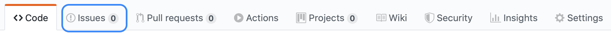
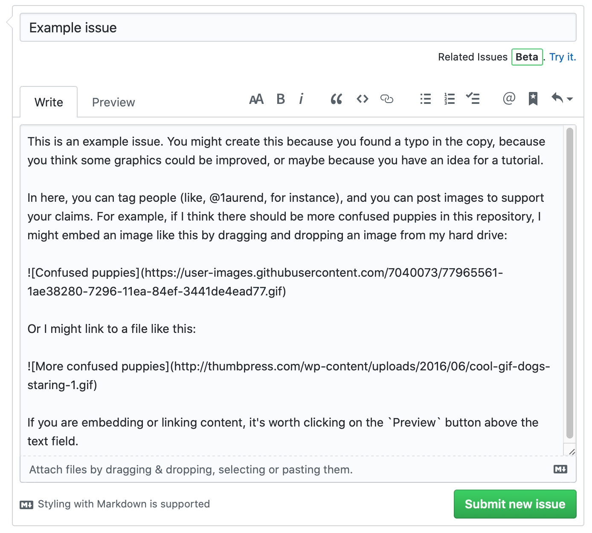

# Github Issues

A great first way to contribute to a Github repository is to open an _issue_.

## What are issues?

Github Issues is a workflow for requesting features, and reporting and tracking the status of bugs. _Almost_ every repository has an issues section.

## Creating an issue

To create an issue, navigate to the homepage of a given repository (e.g., for this repository, go to `https://github.com/learninglab-dev/remote-collab`).

At the top of the page, you will see a horizontal menu bar, which should look something like this: 

Click on the `Issues` tab to navigate to the Issues section. On the upper right, you will see a green button that says `New Issue`.

Once you click on the `New Issue` button, you can create a title for your issue and add some content. In this [example issue](https://github.com/learninglab-dev/remote-collab/issues/1), I have embedded and linked to images. You can tag Github users and use Markdown in Issues, as well!

