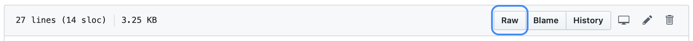
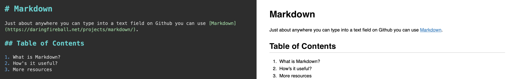

# Markdown

Just about anywhere you can type into a text field on Github you can use [Markdown](https://daringfireball.net/projects/markdown/).

## Table of Contents

1. What is Markdown?
2. How's it useful?
3. More resources

## What is Markdown?

Markdown is a lightweight text formatting syntax which makes it very easy to add basic styling to plain text documents. In fact, the document you are reading right now is written in Markdown.

You can identify Markdown files in the wild by their `.md` suffix.

If you are viewing this document on Github, you should see a menu like this above:

Click on the `Raw` button to see the "raw" version of this document. It's not so intimidating, I promise!

## How's it useful?

At the most basic level, any old plain text is valid Markdown, but you can `add` **some** _styling_ **_if you want_** without too much pain inflicted. You can embed photos, gifs, add lists, tables, and more. Markdown is useful because the "raw" form is just about as readable as the "rendered" form — the syntax is pretty unobtrusive. It is also easily *diffable*: if you make a change to a Markdown document using Git or on Github, it is easy to see the changes made. With Markdown, there is very little standing in the way of your thoughts becoming publishable on the internet, worldwide.

## More Resources

Check out this [Markdown Guide](https://www.markdownguide.org/getting-started/) for all of the nooks and crannies of the syntax, and the [Markdown Cheatsheat](https://github.com/adam-p/markdown-here/wiki/Markdown-Cheatsheet) to see all of the features on a real live Github page. See the official [Writing on Github](https://help.github.com/en/github/writing-on-github) page to see the extra goodies supported on the platform.

You can type Markdown directly into the text fields on Github, but if working on a larger document, check out [MacDown](https://macdown.uranusjr.com). It's free and open source, and provides a real-time rendered preview while you type. Furthermore, it adds some basic styling to the "raw" form to make it hard to make mistakes.

